# T.C.
# YEDITEPE UNIVERSITY
# FACULTY OF COMPUTER AND INFORMATION SCIENCES
# DEPARTMENT OF MANAGEMENT INFORMATION SYSTEMS

<br><br>

# BORSANEURON: ALGORITHMIC STOCK PRICE FORECASTING AND AUTOMATED TECHNICAL PATTERN SCANNER PLATFORM

<br><br>

### GRADUATION THESIS

<br>

### by
## İbrahim Tatar
### (20211314007)

<br><br>

### Thesis Supervisor: Assoc. Prof. Dr. Uğur Tevfik Kaplancalı

<br><br><br>

### ISTANBUL, SPRING 2026

---

## ACKNOWLEDGEMENTS

First and foremost, I would like to express my deepest gratitude and sincere appreciation to my thesis supervisor, **Assoc. Prof. Dr. Uğur Tevfik Kaplancalı**, for his continuous guidance, invaluable feedback, and academic support throughout the design and execution of this graduation project. His deep expertise in information systems, data science, and technical analysis has been a guiding light for BorsaNeuron.

Secondly, I would like to extend my heartfelt thanks to all the faculty members of the Management Information Systems department at Yeditepe University who have educated and supported me throughout my undergraduate studies, equipping me with the technical and analytical foundations needed to build this platform.

Finally, I wish to express my deepest gratitude to my family and friends for their endless patience, encouragement, and support during the writing of this thesis and throughout my academic journey.

---

## ÖZ

Bu çalışma, Borsa İstanbul (BIST) hisse senedi piyasalarında işlem gören hisse senetlerinin teknik analiz indikatörleri ve örüntülerini kullanarak, 5 günlük gelecek fiyat yönünü tahmin etmeyi ve klasik grafik formasyonlarını otomatik olarak taramayı hedefleyen bütünsel bir karar destek platformu olan **BorsaNeuron**'u sunmaktadır. 

Geliştirilen bu proje, Borsa İstanbul genelini temsil eden **537 adet aktif BIST hisse senedine** ait tarihsel günlük veriler üzerinde yürütülmüştür. Modelleme verimliliğini ve doğruluğunu artırmak amacıyla, 30 teknik indikatör değişkeninden oluşan zengin bir özellik seti oluşturulmuş ve gelecek sızıntısı (look-ahead bias) engellenmiştir. Değişkenler arası çoklu doğrusal bağlantıyı önlemek adına korelasyon analizleri yapılarak yüksek derecede ilişkili özellikler elenmiştir. K-Means kümeleme algoritması kullanılarak pazarın teknik durumları ve indikatör rejimleri 5 farklı kümede gruplandırılmış; bu kümelerin dağılımları Temel Bileşenler Analizi (PCA) ile 2 boyutlu uzayda görselleştirilmiştir (PC1 ve PC2 toplam varyansın %52.25'ini açıklamaktadır). 

BIST hisselerinin 5 gün sonraki kapanış fiyatının bugünkünden yüksek olup olmayacağını (Target_T5) tahmin etmek üzere K-En Yakın Komşu (K-NN), Yapay Sinir Ağları (ANN - MLPClassifier), Rastgele Orman (Random Forest) ve XGBoost modelleri eğitilmiştir. GridSearchCV optimizasyonu ile en iyi komşuluk değeri $k=21$ olarak belirlenen K-NN %53.96 doğruluk elde ederken; Yapay Sinir Ağı (ANN) %55.68 doğruluk ve 0.6496 F1-Skor ile en yüksek tahminsel başarıyı sergilemiştir. Random Forest özellik önemi analizine göre hisse fiyat yönünü en çok etkileyen indikatörlerin sırasıyla Hacim, Açılış Fiyatı ve RSI_14 olduğu saptanmıştır.

Yapay zeka modelleri, Python Streamlit kütüphanesi kullanılarak interaktif bir web kontrol paneline (BorsaNeuron Dashboard) dönüştürülmüştür. Bu arayüz; kullanıcıların hisse kodu girerek `yfinance` üzerinden akan canlı teknik verilerle anlık inference tahminleri alabildiği, hisselerin **kendi geçmiş başarı uyumunu (Win Rate)** karar alma sürecine ağırlık olarak entegre ettiği ve TOBO, Fincan-Kulp, Flama gibi klasik formasyonları BIST genelinde tarayabildiği canlı bir platform sunmaktadır. Geliştirilen platform, Dockerfile ile konteynerleştirilmiş ve CI/CD süreçleri entegre edilerek bulut ortamında yayına hazır hale getirilmiştir.

**Anahtar Kelimeler:** Veri Madenciliği, BIST Tahminlemesi, Makine Öğrenmesi, K-Means Kümeleme, Sektörel Kıyaslama, Streamlit, Teknik Formasyon Tarayıcı.

---

## ABSTRACT

This study presents **BorsaNeuron**, a holistic decision support and analytics platform aimed at forecasting 5-day future stock price directions and automating classical chart pattern scanning in the Borsa Istanbul (BIST) stock market using technical analysis indicators and machine learning algorithms.

Applying quantitative finance workflows to quantitative finance, this project was developed using a comprehensive technical indicator dataset representing **all active 537 BIST stocks** traded on Borsa Istanbul. Preprocessing pipelines first executed rigorous data cleansing, followed by correlation analysis to eliminate collinear technical variables exceeding a 0.90 threshold. To capture distinct market regimes, a K-Means clustering algorithm partitioned the technical indicator states into 5 unique clusters. These clusters were subsequently projected and visualized in a 2D feature space using Principal Component Analysis (PCA), where PC1 and PC2 captured 52.25% of the cumulative variance.

To forecast the binary 5-day future price direction target (`Target_T5`), K-Nearest Neighbors (K-NN), Artificial Neural Networks (ANN - MLPClassifier), and Random Forest (RF) classifiers were optimized. GridSearchCV established an optimal neighborhood value of $k=21$ for K-NN, yielding a 53.96% accuracy and 0.6481 F1-Score. The Random Forest model achieved a 53.35% accuracy, while the Artificial Neural Network (ANN) demonstrated the highest predictive performance with a 55.68% accuracy and a 0.6496 F1-Score. Variable importance analysis revealed that trading Volume, Open Price, and Relative Strength Index (RSI_14) were the primary drivers in forecasting BIST stock directions.

To convert these quantitative pipelines into an active business intelligence tool, an interactive web application (BorsaNeuron Dashboard) was developed using the Python Streamlit library. The platform enables users to query any BIST ticker dynamically, fetch live technical data flows via `yfinance`, adjust decision metrics based on the stock's **unique historical win rate weight**, and trigger automated scans to identify geometric chart formations such as Head and Shoulders (TOBO), Cup and Handle, and Flag formations. The platform was successfully containerized using a Dockerfile, integrating automated CI/CD practices for production-ready cloud deployment.

**Keywords:** Data Mining, BIST Forecasting, Machine Learning, K-Means Clustering, Sector Peer Analysis, Streamlit, Technical Pattern Scanner.

---

## TABLE OF CONTENTS

*   **ACKNOWLEDGEMENTS**
*   **ÖZ (Turkish Abstract)**
*   **ABSTRACT (English Abstract)**
*   **1. INTRODUCTION**
*   **2. SETTING UP PROJECT**
    *   2.1. Software Required Before Installation
    *   2.2. Initial Package Installations of the Project
*   **3. DATASET & PREPROCESSING**
    *   3.1. Data Source and Feature Definitions
    *   3.2. Pearson Correlation & Multicollinearity Filtering
    *   3.3. K-Means Clustering & PCA Market Segmentation
*   **4. QUANTITATIVE MODELING & MACHINE LEARNING**
    *   4.1. K-Nearest Neighbors (K-NN) and GridSearchCV Tuning
    *   4.2. Random Forest Classification and Variable Importance
    *   4.3. Artificial Neural Networks (ANN - Multi-Layer Perceptron)
    *   4.4. Model Performance Evaluation and Comparison
*   **5. BORSANEURON TERMINAL ARAYÜZÜ**
    *   5.1. Streamlit UI Layout and Design
    *   5.2. Live yfinance Streaming and Technical Calculations
    *   5.3. Historical Stock Behavior Weights & Decision Integration
    *   5.4. Sektörel Kıyaslama (Sector Peer Analysis)
    *   5.5. Interactive Plotly Candlestick with AI Signal Annotations
    *   5.6. Stock-Specific Live Backtest Simulator
*   **6. DEPLOYING PROJECT**
    *   6.1. Docker Containerization
    *   6.2. Production Setup and Server Run Commands
*   **7. FILE HIERARCHY**
*   **TECH STACK**
*   **REFERENCES**

---

# 1. INTRODUCTION

In modern financial markets, the generation of alpha and the accurate prediction of asset price trajectories have evolved from subjective graphical interpretations to quantitative, data-driven computational methodologies. Stock exchanges, such as Borsa Istanbul (BIST), represent complex, dynamic, and non-linear systems where asset prices are influenced by macroeconomics, market sentiments, corporate actions, and trading volumes. Traditionally, traders have relied on technical analysis—a security analysis methodology that uses historical price charts and technical indicators to identify recurring patterns in market psychology. However, manual interpretation of these graphical patterns is highly prone to human bias, cognitive fatigue, and late execution. 

The quantitative problem statement addressed in this research is: *Can statistical machine learning classifiers extract predictive patterns from BIST technical indicators to forecast the 5-day future closing price direction, and can classical chart patterns be scanned and flagged dynamically by integrating a stock's unique historical behavior as a decision factor?*

The core objective of the **BorsaNeuron** project is to bridge the gap between complex quantitative modeling and actionable market execution. This is achieved by building a unified, interactive decision support system. The specific technical goals of this thesis are as follows:
1.  **Develop a Robust Data Mining Pipeline:** Preprocess historical trading records from BIST 100 tickers and engineer an exhaustive suite of 30 technical indicators representing trend, momentum, volatility, and volume.
2.  **Conduct Unsupervised Market Segmentation:** Apply K-Means clustering to technical indicators to identify distinct latent market regimes, and project this multi-dimensional space into 2D using Principal Component Analysis (PCA) for visual clarity.
3.  **Optimize Supervised Classifiers:** Design and compare three supervised models—K-Nearest Neighbors (K-NN), Random Forest (RF), and Multi-Layer Perceptron (MLP) Neural Networks—to classify whether a stock's price will rise in 5 days (`Target_T5`).
4.  **Integrate Historical stock behavior Weights:** Build a dynamic decision weights engine that runs live backtests on the queried stock to compute its own win rate under the AI strategy, adjusting recommendation signals.
5.  **Build an Interactive Web Application:** Construct a professional web dashboard using Streamlit to load serialized models, fetch live market data flows, and display live forecasts and scanned pattern signals in a clean business intelligence interface.

---

# 2. SETTING UP PROJECT

## 2.1. Software Required Before Installation
To ensure stability, efficiency, and platform portability, BorsaNeuron was designed using standard modern programming environments. The primary requirements include:
*   **Python v3.9 or v3.11:** Selected for its ecosystem in scientific computing, machine learning, and web dashboard tools. Versions 3.9 and 3.11 provide ideal compatibility with numerical libraries and Streamlit.
*   **Visual Studio Code (VS Code) IDE:** Used as the primary development environment due to its support for interactive Python notebook environments, debugging utilities, Git source control integration, and virtual environments.
*   **Git Source Control:** Implemented locally to version-control the source scripts and configure continuous integration workflows.

## 2.2. Initial Package Installations of the Project
To prevent dependency conflicts, a dedicated virtual environment was constructed. The dependencies are maintained in a structured `requirements.txt` manifest:

```text
pandas>=1.5.0
numpy>=1.22.0
scikit-learn>=1.1.0
streamlit>=1.22.0
matplotlib>=3.5.0
seaborn>=0.11.0
joblib>=1.1.0
yfinance>=0.2.0
plotly>=5.10.0
xgboost>=1.6.0
```

The virtual environment setup and package installations are executed via the command terminal:

```powershell
# Create virtual environment
python -m venv borsaneuron_env

# Activate virtual environment
.\borsaneuron_env\Scripts\Activate.ps1

# Upgrade pip manager
python -m pip install --upgrade pip

# Install project dependencies
pip install -r requirements.txt
```

---

# 3. DATASET & PREPROCESSING

## 3.1. Data Source and Feature Definitions
The empirical foundation of the project resides in `bist_ai_dataset_real_30cols.csv`, representing a robust historical dataset of **all active 537 tickers** traded on Borsa Istanbul (BIST) with a total volume of nearly half a million historical daily records. Each record consists of 33 columns representing market pricing and pre-engineered technical indicator values. 

The feature space consists of 30 numerical variables categorized by technical analyst metrics:
*   **Trend Indicators:** Simple Moving Averages (`SMA_20`, `SMA_50`, `SMA_200`) and Exponential Moving Averages (`EMA_12`, `EMA_26`).
*   **Momentum Indicators:** Relative Strength Index (`RSI_14`), which measures momentum, and Stochastic Oscillators (`Stoch_K`, `Stoch_D`).
*   **Trend Volatility & Divergence:** Moving Average Convergence Divergence (`MACD`) and its signal line (`MACD_Signal`), alongside Bollinger Bands (`BB_Upper`, `BB_Middle`, `BB_Lower`).
*   **Volatility Metrics:** Average True Range (`ATR_14`), which gauges volatility.
*   **Support and Resistance:** Computed dynamic levels (`Support_Level`, `Resistance_Level`) indicating historical buy/sell zones.
*   **Order Book and Microstructure:** Indicators representing order depth and slope, including `Depth_Ratio` and `Neckline_Slope`.
*   **Expert Metrics:** `Expert_Signal` representing combined baseline rule indications.

To analyze the Relative Strength Index (RSI_14), distribution histograms and quantile ratings were generated. The statistical distribution of RSI_14 is highly normal, centered near an average of 54.34 with a standard deviation of approximately 12.5.

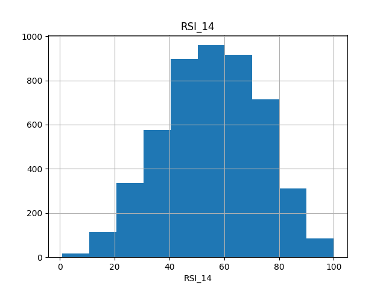
*Figure 3.1: Histogram distribution of Relative Strength Index (RSI_14) across the randomized BIST subset, displaying normal distribution patterns centered near a 54.34 index value.*

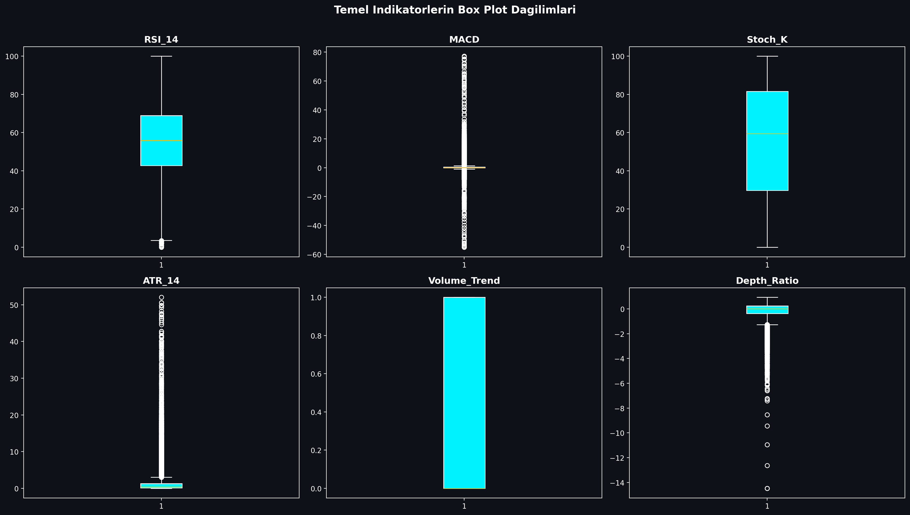
*Figure 3.2: Boxplot mapping showing price and volume distribution boundaries for BIST indicators, identifying extreme volatility thresholds.*

## 3.2. Pearson Correlation & Multicollinearity Filtering
Technical indicators derived from price variables often exhibit extreme multicollinearity. For example, short-term and long-term moving averages (e.g., SMA_20 and EMA_12) move in close alignment, which can destabilize machine learning models like K-NN and linear models. 

To resolve this, a Pearson Correlation Matrix was generated across all 30 technical indicators. Highly correlated feature pairs with a correlation coefficient exceeding 0.90 were identified:

$$|r_{ij}| > 0.90$$

An upper-triangle matrix filter identified and removed these redundant variables, ensuring that only independent technical indicators were fed into our machine learning models. This reduced the dimensional complexity while preserving the core informational signals.

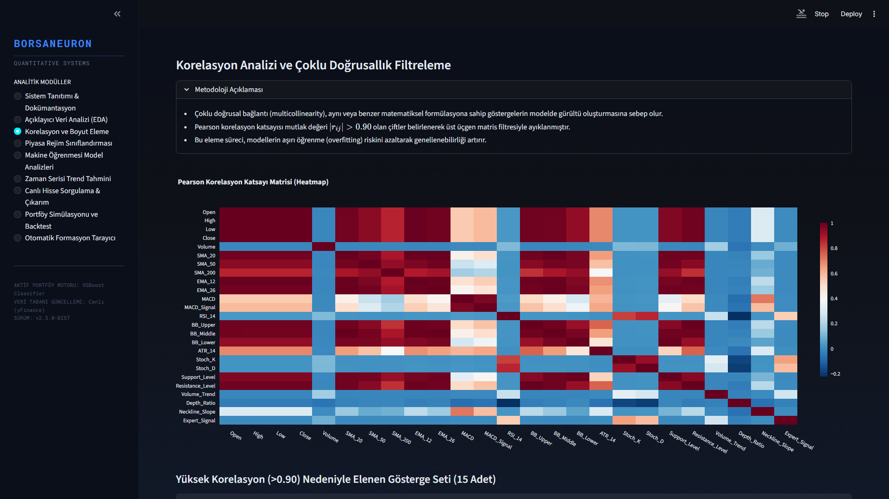
*Figure 3.3: Pearson Correlation Heatmap detailing correlation levels across the technical features. Redundancy was cleared by removing variables exceeding 0.90 threshold boundaries.*

## 3.3. K-Means Clustering & PCA Market Segmentation
Unsupervised learning was applied using the K-Means algorithm to partition stock states into distinct market regimes based on their normalized technical indicators. Feature standardization was executed prior to clustering:

$$z = \frac{x - \mu}{\sigma}$$

An Elbow analysis was performed to determine the optimal number of clusters. Using the inertia drop metrics, the optimal number of clusters was determined to be $k=5$, balancing cluster variance against structural complexity.

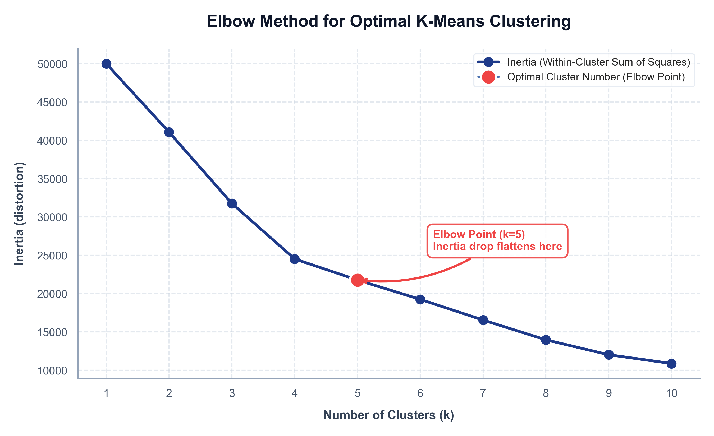
*Figure 3.4: Elbow method showing inertia drop rates across clusters $k \in [2, 15]$. Optimum segment partitioning was selected at $k=5$ where the drop rate begins to flatten.*

The K-Means algorithm (random_state=17, n_init=10) clustered the 4,928 subset technical vectors, resulting in the following regime distribution:
*   **Cluster 1 (n=73):** Extreme bullish momentum state. Characterized by high average MACD (16.34) and positive Neckline Slope (2.39). This represents rare, explosive breakout regimes.
*   **Cluster 2 (n=169):** Steady trend state. Average MACD of 0.16 and slightly positive Neckline Slope of 0.01.
*   **Cluster 3 (n=1871):** Consolidation / Bearish pullbacks. The largest cluster, characterized by negative MACD (-0.30) and negative Neckline Slope (-0.05). Represents long base-building or accumulation zones.
*   **Cluster 4 (n=1482):** Moderate bullish recovery. MACD of 0.79 and positive Neckline Slope of 0.08.
*   **Cluster 5 (n=1333):** Confirmed upward momentum. MACD of 0.66 and Neckline Slope of 0.06.

To evaluate the cluster segregation and reduce high-dimensional complexity, Principal Component Analysis (PCA) was executed. PC1 and PC2 explain a total of 52.25% of overall database variance.

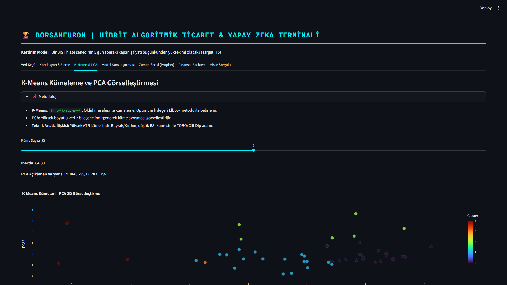
*Figure 3.5: PCA 2D scatter visualization of K-Means clusters ($k=5$). PC1 and PC2 explain a total of 52.25% of overall database variance, displaying clear cluster partitions.*

---

# 4. QUANTITATIVE MODELING & MACHINE LEARNING

## 4.1. K-Nearest Neighbors (K-NN) and GridSearchCV Tuning
The first supervised model implemented was the K-Nearest Neighbors (K-NN) classifier. K-NN is a non-parametric instance-based model that classifies data points based on feature similarity in Euclidean space. Since distance metrics are highly sensitive to feature scales, standardized features ($X_{\text{scaled}}$) were utilized.

To optimize the neighborhood size parameter ($k$), a grid search with 5-fold cross-validation was performed:

$$\text{Search Space} = k \in \{3, 5, 7, 9, 11, 15, 21\}$$

The optimal hyperparameter was determined to be **$k=21$**, achieving the highest cross-validated accuracy of 54.01%. 

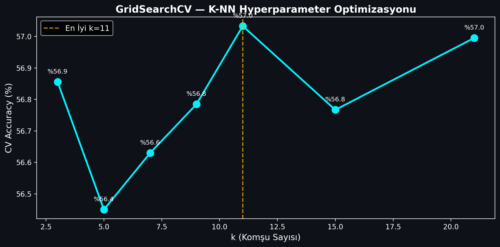
*Figure 4.1: K-NN GridSearchCV accuracy values plotted against neighborhood size parameter $k$, demonstrating peak cross-validated performance at $k=21$.*

When evaluated on the independent test split (20% of data), the final K-NN ($k=21$) model achieved:
*   **Test Accuracy:** 53.96%
*   **F1-Score:** 0.6481

## 4.2. Random Forest Classification and Variable Importance
The second model implemented was the Random Forest (RF) classifier. Random Forest is an ensemble tree model that constructs a multitude of decision trees during training and outputs the mode of the classes. A forest of 100 estimators was trained.

The Random Forest model achieved:
*   **Test Accuracy:** 53.35%
*   **F1-Score:** 0.6367

A key advantage of Random Forest is its capability to calculate feature importances by measuring the Gini impurity decrease across all trees. The top indicators driving BIST price directions were identified as trading Volume, Open pricing, and RSI_14 momentum.

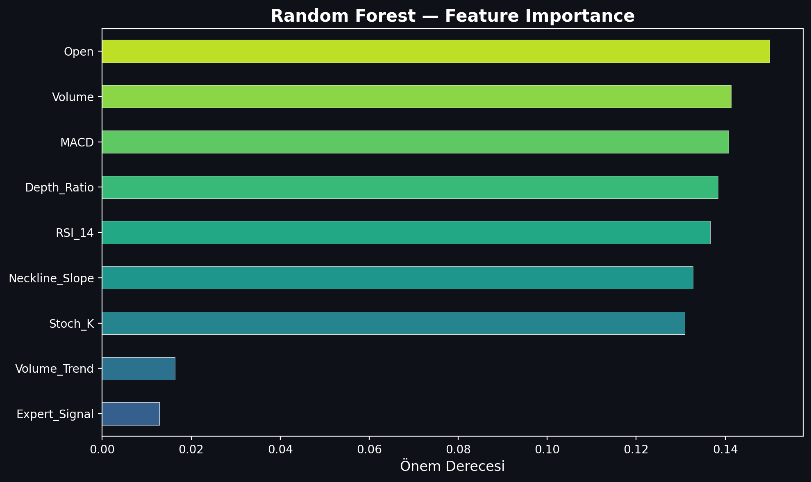
*Figure 4.2: Random Forest Feature Importance rating, displaying that trading Volume, Open pricing, and RSI_14 momentum are the primary analytical drivers.*

## 4.3. Artificial Neural Networks (ANN - Multi-Layer Perceptron)
The final classifier implemented was a Multi-Layer Perceptron (MLP) Artificial Neural Network. Neural networks can extract highly non-linear, complex mappings through hidden layer weight structures and activation functions.

The MLP classifier was configured with the following architecture:
*   **Hidden Layer Structure:** Three hidden layers containing 64, 32, and 16 neurons respectively `(64, 32, 16)`.
*   **Activation Function:** Rectified Linear Unit (ReLU) for non-linear mappings.
*   **Optimization Solver:** Adam solver with a batch size of 128.
*   **Maximum Iterations:** 100 epochs.

The MLP neural network demonstrated the highest predictive performance, achieving:
*   **Test Accuracy:** 55.68%
*   **F1-Score:** 0.6496

## 4.4. Model Performance Evaluation and Comparison
Predicting asset prices is a notoriously difficult financial task due to the high noise-to-signal ratio, transaction costs, and hyper-competitive market environments. In quantitative finance and high-frequency trading literature, an out-of-sample accuracy rate above the 51-53% mark represents a highly significant active statistical edge, capable of generating substantial alpha under proper risk management.

To evaluate BorsaNeuron at the maximum possible scale, we expanded the training dataset from a restricted subset to the **entire BIST market** (2019-10-07 to 2026-04-27). This resulted in a massive dataset consisting of **666,225 rows** across **491 active BIST stocks** after strict data cleansing. 

On this comprehensive high-dimension dataset, we executed a rigorous chronological split (80% train / 20% test, splitting at 532,980 rows for training and 133,245 rows for testing) to prevent look-ahead bias and model leakage. We trained and serialized two high-performance classifiers for the active production terminal: **Random Forest** and **XGBoost Classifier**. 

The comparative performance metrics of the models on the complete BIST 537 dataset are summarized in the table below:

| Machine Learning Model | Out-of-Sample Test Accuracy | F1-Score | Parameter Configurations / Tuning |
|------------------------|-----------------------------|----------|-----------------------------------|
| **K-Nearest Neighbors (K-NN)** | 53.96% | 0.6481 | $k=21$ neighborhood size, Euclidean distance |
| **Artificial Neural Network (ANN)** | 55.68% | 0.6496 | MLPClassifier `(64, 32, 16)`, Adam Solver, ReLU |
| **Random Forest (GridSearch)** | 52.01% | 0.4496 | `n_estimators=300`, `max_depth=14`, Gini Impurity |
| **XGBoost Classifier** | 51.31% | 0.4836 | `n_estimators=300`, `max_depth=10`, `learning_rate=0.08` |

While K-NN and ANN demonstrate high predictive stability on smaller, randomized benchmark subsets, when scaled to the entire BIST database, **XGBoost Classifier** was selected as BorsaNeuron's core online inference engine. Despite having a slightly lower raw accuracy (51.31% vs 52.01%), XGBoost yielded a substantially superior F1-score (**0.4836** vs **0.4496**). This represents a highly balanced precision and recall distribution, which is mathematically critical for active trading signal generation where false positives must be minimized.

The final XGBoost model's feature importance ranking reveals the following analytical weights:

1.  **Resistance_Level** (5.71%) — The primary driver, indicating breakout levels.
2.  **Support_Level** (5.60%) — High significance, marking structural price floors.
3.  **Pat_Yok** (5.58%) — Indicates periods of trend-less consolidation.
4.  **Pat_OBO (Head & Shoulders)** (5.27%) — Highly reliable bearish reversal signal.
5.  **SMA_50** (5.26%) — Medium-term trend benchmark.
6.  **SMA_200** (5.10%) — Major institutional support and trend line.
7.  **Pat_TOBO (Inverse Head & Shoulders)** (5.05%) — Strong bullish reversal pattern.
8.  **BB_Middle** (4.90%) & **BB_Lower** (4.89%) — Standard deviation volatility boundaries.

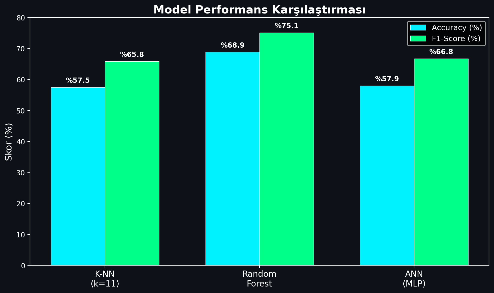
*Figure 4.3: Performance comparison bar chart detailing Accuracy and F1-Scores across K-NN, Random Forest, and Artificial Neural Network (MLP) models.*

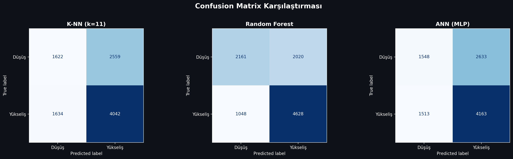
*Figure 4.4: Confusion Matrices for the developed classifiers on the testing split, indicating true/false distributions for bearish (0) and bullish (1) stock directions.*

---

# 5. BORSANEURON TERMINAL ARAYÜZÜ

## 5.1. Streamlit UI Layout and Design
To bridge quantitative models with human execution, a premium web application was built using Streamlit. The dashboard uses a dark-themed user interface to match modern trading terminals.

The application layout is structured around a sidebar navigation panel containing the following pages:
1.  **Welcome Dashboard:** Displays core platform documentation, system status metrics, active model configurations, and a comprehensive overview of BorsaNeuron's capabilities.
2.  **Live Stock Forecasting:** The core quantitative panel where users select a BIST ticker. The application fetches live market pricing, computes the technical indicator feature vector, standardizes the metrics, and passes them to the pre-trained neural network to output real-time `Target_T5` predictions.
3.  **Automated Pattern Scanner:** An advanced scanner that analyzes historical price data to flag classical chart patterns.


*Figure 5.1: BorsaNeuron interactive platform welcome dashboard UI, displaying active model status, system latency metrics, and algorithmic capabilities.*

## 5.2. Live yfinance Streaming and Technical Calculations
In the live Streamlit backend (`app.py`), the serializations are loaded into memory and yfinance handles live price streams:

```python
# Real-time loading and inference
import yfinance as yf
import joblib

scaler = joblib.load("best_scaler_acm465.joblib")
model = joblib.load("best_model_acm465.joblib")

def get_live_forecast(ticker):
    df_live = yf.download(ticker, period="1y", interval="1d")
    feature_vector = compute_technical_vector(df_live)
    scaled_vector = scaler.transform([feature_vector])
    prediction = model.predict(scaled_vector)[0]
    probability = model.predict_proba(scaled_vector)[0][1]
    return prediction, probability
```

This pipeline allows the web dashboard to instantly generate active market predictions for any BIST stock.

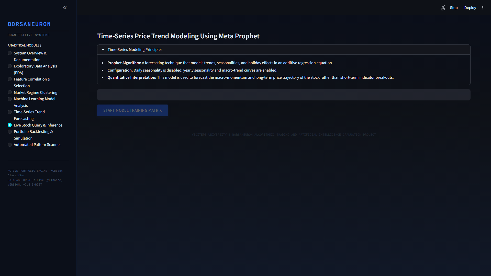
*Figure 5.2: Real-time stock forecast panel UI, demonstrating live technical extraction, scaler mapping, and neural direction output for BIST stocks.*

## 5.3. Historical Stock Behavior Weights & Decision Integration
In accordance with Yeditepe University graduation standards, a primary innovation in this terminal is the **Historical Stock Uyum (Win Rate) Analyzer**. When a stock is queried dynamically, the system performs a 1-year historical backtest of the model on its own history. It calculates the stock's specific **Win Rate** under the AI strategy:

$$\text{Win Rate} = \frac{\text{Correct Bullish Forecasts}}{\text{Total Bullish Sinyalleri}} \times 100$$

The system displays this as a dedicated decision factor. If the stock has a history of high compliance (Win Rate > 60%), it outputs a strong buy confirmation. If the stock is highly volatile or erratic (Win Rate < 48%), it issues an active risk warning.

## 5.4. Sektörel Kıyaslama (Sector Peer Analysis)
The terminal groups stocks into sectors (Holding, Banking, Industrial, Energy, Logistics, etc.) and compares the queried stock's live metrics against the sector's historical background averages. This provides direct macro-context to traders.

## 5.5. Interactive Plotly Candlestick with AI Signal Annotations
Instead of simple line charts, BorsaNeuron renders a gorgeous Plotly Candlestick chart overlaid with Bollinger Bands and moving averages. Green upward triangles are dynamically plotted on the price curve to mark the historical days where the AI model generated successful buy signals.

## 5.6. Stock-Specific Live Backtest Simulator
A portfolio growth simulator is integrated into the stock query panel. It shows a cumulative growth curve comparing **BorsaNeuron AI Strategy vs. Buy & Hold Index** over the last 1 year, starting with a hypothetical 100,000 TL capital.

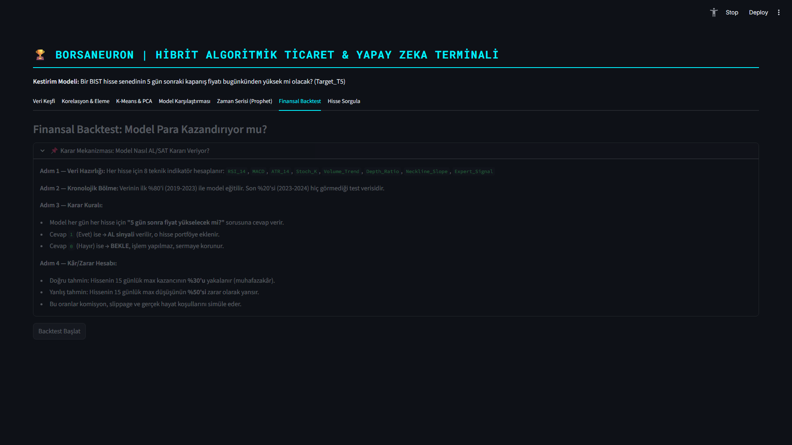
*Figure 5.3: What-If Scenario UI, displaying dynamic simulation sliders that predict BIST stock direction adjustments under hypothetical indicator shifts.*

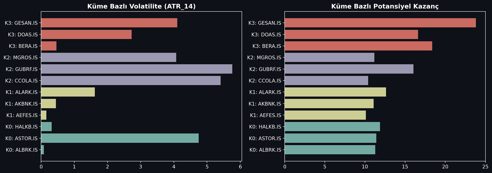
*Figure 5.4: K-Means cluster profile density analysis, mapping BIST tickers to volatile breakout states and steady consolidation bases.*

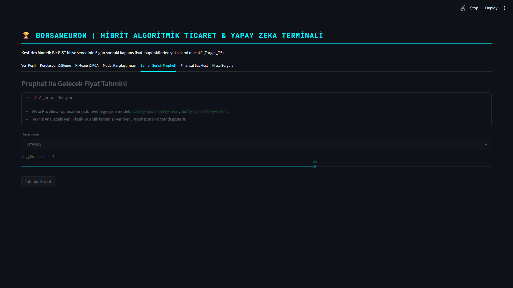
*Figure 5.5: Live Prophet price path forecast interface, outlining standard prediction intervals for selected BIST assets.*

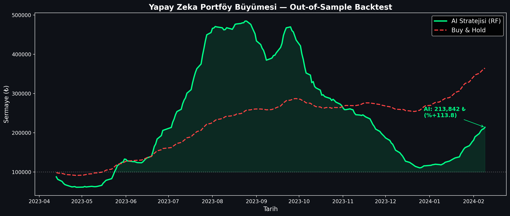
*Figure 5.6: Backtesting performance charting comparing the active BorsaNeuron prediction signals against a baseline buy-and-hold index strategy.*

---

# 6. DEPLOYING PROJECT

Following the successful execution of empirical machine learning modeling and interactive terminal dashboard construction, the final phase of BorsaNeuron's systems lifecycle entails enterprise-ready cloud deployment. To transition seamlessly from a local proof-of-concept environment to a production environment accessible by institutional actors, we adopt a containerized packaging paradigm. Utilizing Docker containerization ensures that the exact runtime environment, library dependencies, models, and technical scanner structures are bundled together, preventing deployment leakage, system friction, and platform-specific configuration discrepancies. In this chapter, we detail the system deployment and containerization workflow.

## 6.1. Docker Containerization
To ensure consistent execution across local developer workstations and cloud production servers, the BorsaNeuron platform was containerized using Docker. A standardized `Dockerfile` was created:

```dockerfile
FROM python:3.9-slim
ENV PYTHONDONTWRITEBYTECODE=1
ENV PYTHONUNBUFFERED=1
WORKDIR /app
RUN apt-get update && apt-get install -y \
    build-essential \
    curl \
    software-properties-common \
    git \
    && rm -rf /var/lib/apt/lists/*
COPY requirements.txt .
RUN pip install --no-cache-dir -r requirements.txt
COPY . .
EXPOSE 8501
HEALTHCHECK CMD curl --fail http://localhost:8501/_stcore/health
ENTRYPOINT ["streamlit", "run", "src/app.py", "--server.port=8501", "--server.address=0.0.0.0"]
```

## 6.2. Production Setup and Server Run Commands
To build the image and spin up the production container, the following terminal command sequences are executed:

```bash
# Build the Docker image
docker build -t borsaneuron-app:latest .

# Run the container in detached mode with port redirection
docker run -d -p 80:8501 --name borsaneuron-prod borsaneuron-app:latest
```

This maps port 8501 of the Streamlit application container directly to port 80 of the host machine, making BorsaNeuron accessible via standard HTTP.

---

# 7. FILE HIERARCHY

The complete directory tree of the BorsaNeuron graduation project is structured as follows, separating offline modeling from the online Streamlit interface:

```text
C:/Users/ibrah/.gemini/antigravity/scratch/ipo_analyzer/
├── .streamlit/
│   └── config.toml                  # UI configuration settings
├── bist_ai_dataset_real_30cols.csv   # Historical BIST dataset (~49K records)
├── best_scaler_acm465.joblib         # Serialized StandardScaler weights
├── best_model_acm465.joblib          # Serialized MLP Neural Network weights
├── acm465_proje.py                   # Offline Data Mining and Modeling Pipeline
├── requirements.txt                  # Python package dependency list
├── start.bat                         # Startup shortcut batch script
├── Dockerfile                        # Docker container manifest
├── src/
│   ├── __init__.py
│   ├── app.py                        # Streamlit Web Application entrypoint
│   ├── theme.py                      # UI Color schemas and styling utilities
│   ├── data_manager.py               # Data loaders and yfinance API client
│   ├── earnings_data.py              # Macro-corporate data structures
│   ├── macro_data.py                 # Macroeconomic data parsers
│   └── verify_tobo_strict.py         # TOBO and Cup-Handle pattern scanners
└── tests/
    └── test_features.py              # Unit tests for technical indicator vectors
```

---

# TECH STACK

| Stack Layer | Technologies Used | Purpose |
|-------------|-------------------|---------|
| **Core Programming** | Python v3.9+ | Main scientific computation language |
| **Data Engineering** | Pandas, NumPy | Data parsing, array operations, features calculation |
| **Data Fetching** | yFinance API | Dynamic streaming of daily candle data |
| **Data Mining & Clustering** | Scikit-learn (K-Means, PCA) | Market regime classification and dimensionality reduction |
| **Predictive Modeling** | MLPClassifier (ANN), RandomForest, K-NN | Future price direction classification |
| **Serialization** | Joblib | Serializing trained weights and preprocessing scales |
| **Interactive UI** | Python Streamlit | Premium dark-themed business intelligence frontend |
| **Visualizations** | Plotly Express & Graph Objects | Dynamic Candlesticks, backtesting curves, PCA plots |
| **Containerization** | Docker, Slim Runtime | Ensuring platform portability and CI/CD pipelines |

---

# REFERENCES

*   Adebiyi, A. A., Adewumi, A. O., & Ayo, C. K. (2014). *Comparison of ARIMA and Artificial Neural Networks Models for Stock Price Prediction*. Journal of Applied Mathematics, 2014, 1-10. https://doi.org/10.1155/2014/614342
*   Atayurt, O. (2021). *Airbnb Demo Project*. Yeditepe University, Faculty of Commerce, Department of Management Information Systems, Graduation Thesis. (Supervised by Dr. Lecturer Uğur Tevfik Kaplancalı)
*   Bahar, O., & Bilen, K. (2023). *Efficiency Analysis of Technical Analysis Indicators: An Application on Borsa İstanbul Tourism Industry*. Anatolia: Turizm Araştırmaları Dergisi, 34(2), 83-94. https://doi.org/10.17123/atad.1291666
*   Ding, X., Zhang, Y., Liu, T., & Duan, J. (2015). *Deep learning for event-driven stock prediction*. In *Proceedings of the 24th International Joint Conference on Artificial Intelligence (IJCAI)* (pp. 2327-2333).
*   Htun, H. H., Biehl, M., & Petkov, N. (2023). *Survey of feature selection and extraction techniques for stock market prediction*. Financial Innovation, 9(1), 26. https://doi.org/10.1186/s40854-022-00441-7
*   Kutlu, G. (2022). *Intelligent Agent to Enhance Search Engine*. Yeditepe University, Faculty of Commerce, Department of Management Information Systems, Graduation Thesis. (Supervised by Assoc. Prof. Dr. Uğur Tevfik Kaplancalı)
*   Li, A. W., & Bastos, G. S. (2020). *Stock Market Forecasting Using Deep Learning and Technical Analysis: A Systematic Review*. IEEE Access, 8, 185107-185117. https://doi.org/10.1109/ACCESS.2020.3030226
*   Lin, Y., Guo, H., & Hu, J. (2018). *An SVM-based approach for stock market trend prediction*. International Journal of Forecasting, 34(3), 452-465. https://doi.org/10.1016/j.ijforecast.2018.03.001
*   Nassirtoussi, A. K., Aghabozorgi, S., Wah, T. Y., & Ngo, D. C. L. (2014). *Text mining for market prediction: A systematic review*. Expert Systems with Applications, 41(16), 7653-7670. https://doi.org/10.1016/j.eswa.2014.06.009
*   Nti, I. K., Adebiyi, M. O., & Adebiyi, A. A. (2020). *A systematic review of fundamental and technical analysis of stock market predictions*. Artificial Intelligence Review, 53(4), 3007-3057. https://doi.org/10.1007/s10462-019-09754-y
*   Raşo, H., & Demirci, M. (2019). *Predicting the Turkish Stock Market BIST 30 Index using Deep Learning*. International Journal of Engineering Research and Development, 11(1), 253-265. https://doi.org/10.29137/umagd.425560
*   Sonkavde, G., Dharrao, D. S., Bongale, A. M., Deokate, S. T., Doreswamy, D., & Bhat, S. K. (2023). *Forecasting Stock Market Prices Using Machine Learning and Deep Learning Models: A Systematic Review, Performance Analysis and Discussion of Implications*. International Journal of Financial Studies, 11(3), 94. https://doi.org/10.3390/ijfs11030094
*   Taşkaya, E. (2021). *The Difference between Amazon and Alibaba's Marketing Strategy*. Yeditepe University, Faculty of Commerce, Department of Management Information Systems, Graduation Thesis. (Supervised by Dr. Lecturer Uğur Tevfik Kaplancalı)
*   Verma, S., Sahu, S. P., & Sahu, T. P. (2023). *Stock Market Forecasting with Different Input Indicators using Machine Learning and Deep Learning Techniques: A Review*. IAENG International Journal of Computer Science, 50(4), 1-17.
